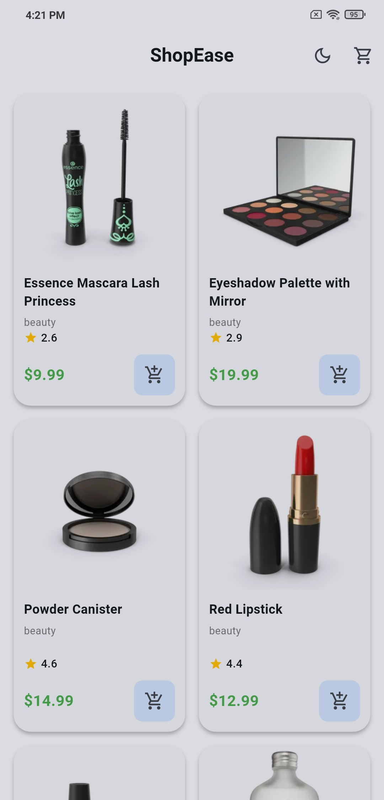
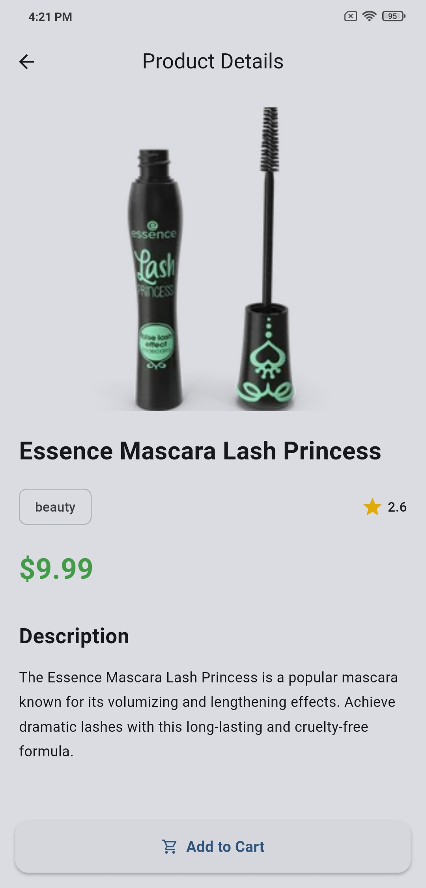
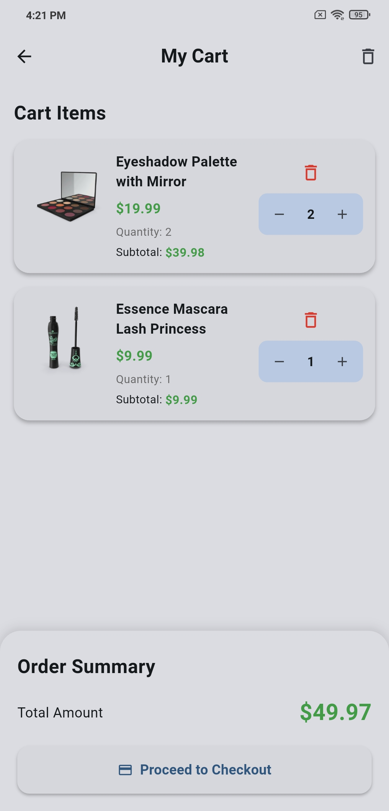
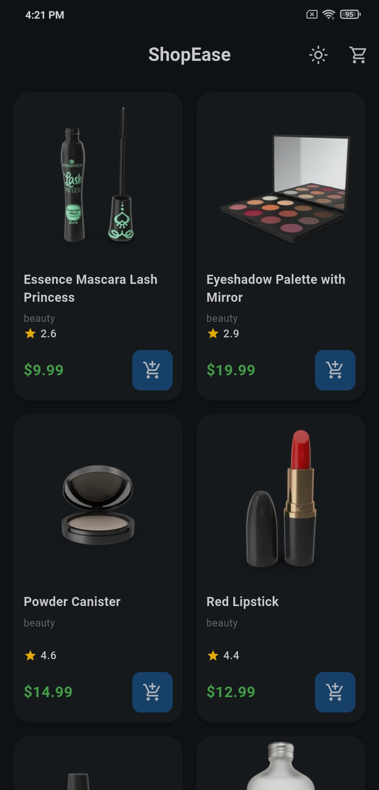
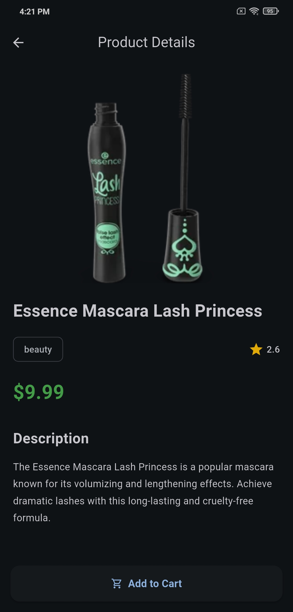
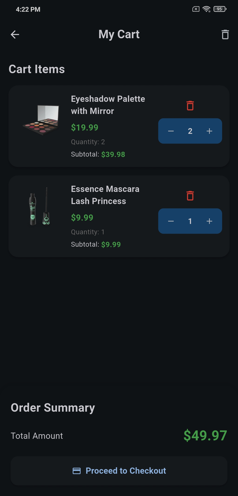

# ShopEase

A modern Flutter e-commerce application built using Clean Architecture principles, BLoC state management, Dependency Injection, and local persistence with Hive CE.

## Features

### Product Listing

* Fetch products from remote API
* Grid-based responsive product catalog
* Pull-to-refresh support
* Product ratings and pricing display
* Cached network images

### Product Details

* Detailed product information screen
* Hero animations for smooth navigation
* Product description, category, rating, and price
* Add product to cart directly

### Cart Management

* Add products to cart
* Increase/decrease item quantity
* Remove individual items
* Clear entire cart
* Automatic total price calculation

### Offline Persistence

* Cart data persisted using Hive CE
* Cart restored after app restart

### Theme Support

* Light Mode
* Dark Mode
* Theme preference persistence

### UI Enhancements

* Reusable widgets
* Empty state views
* Error handling views
* Loading indicators
* Responsive layouts
* Material Design UI

---

## Architecture

The project follows a Feature-First Clean Architecture approach.

```text
lib/
│
├── core/
│   ├── network/
│   ├── theme/
│   └── widgets/
│
├── features/
│   ├── product/
│   │   ├── data/
│   │   ├── presentation/
│   │   └── ...
│   │
│   ├── cart/
│   │   ├── data/
│   │   ├── presentation/
│   │   └── ...
│   │
│   └── theme/
│       ├── data/
│       └── presentation/
│
├── injection.dart
└── main.dart
```

---

## State Management

The application uses:

* Flutter BLoC
* Cubit (Theme Management)

Benefits:

* Predictable state management
* Scalable architecture
* Separation of concerns
* Easy testing and maintenance

---

## Packages Used

### State Management

* flutter_bloc

### Dependency Injection

* get_it

### Networking

* dio

### Local Storage

* hive_ce
* hive_ce_flutter

### Image Caching

* cached_network_image

### Utilities

* equatable

---

## API

Products are fetched from:

https://dummyjson.com/products

---

## Screenshots

### Product Listing



### Product Detail



### Cart Page



### Dark Mode







## Getting Started

### Prerequisites

* Flutter SDK
* Android Studio / VS Code
* Android SDK

### Installation

Clone the repository:

```bash
git clone https://github.com/novincdavis123/ShopEase.git
```

Navigate to project folder:

```bash
cd shopease
```

Install dependencies:

```bash
flutter pub get
```

Run the application:

```bash
flutter run
```

---

## Build APK

```bash
flutter build apk --release
```

Generated APK:

```text
build/app/outputs/flutter-apk/app-release.apk
```

---

## Key Highlights

* Clean Architecture
* Feature-First Structure
* BLoC State Management
* Dependency Injection using GetIt
* Dio Networking
* Hive CE Local Persistence
* Theme Persistence
* Offline Cart Storage
* Reusable UI Components
* Dark Mode Support
* Production-Oriented Code Structure

---

## Author

Novin Davis

Flutter Developer
